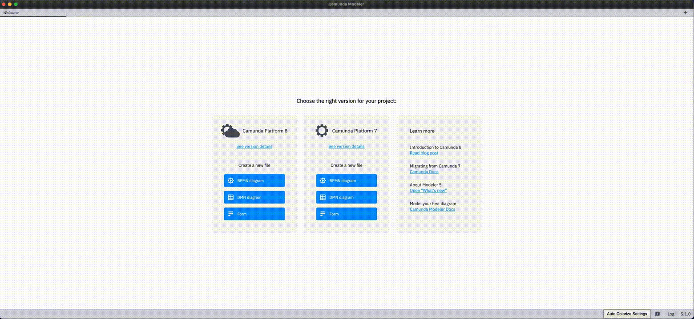

# camunda-modeler-auto-colorize-plugin

[Camunda Modeler](https://github.com/camunda/camunda-modeler/) plugin to automatically colorize certain BPMN elements.



## How to use

1. [Download](https://github.com/eric-hess/camunda-modeler-auto-colorize-plugin/releases/download/0.1.0/camunda-modeler-auto-colorize-plugin.zip) the latest version and copy the extracted folder into the `plugins` directory of the Camunda Modeler
2. Start the Camunda Modeler

Refer to the [plugins documentation](https://docs.camunda.io/docs/components/modeler/desktop-modeler/plugins/) to get detailed information on how to create and integrate Camunda Modeler plugins.

## Development Setup

Firstly, clone this repository to your machine
```bash
$ git clone https://github.com/eric-hess/camunda-modeler-auto-colorize-plugin.git
$ cd camunda-modeler-auto-colorize-plugin
```

Install all dependencies

```bash
$ npm install
```

To work properly inside the Camunda Modeler this plugin needs to be bundled.

```bash
$ npm run build
```

## Compatibility Notice

This plugin is currently only compatible with following Camunda Modeler versions.

| Camunda Modeler | auto-colorize-plugin |
|---|---|
| 5.x | 0.1.0 or newer |

## License

MIT